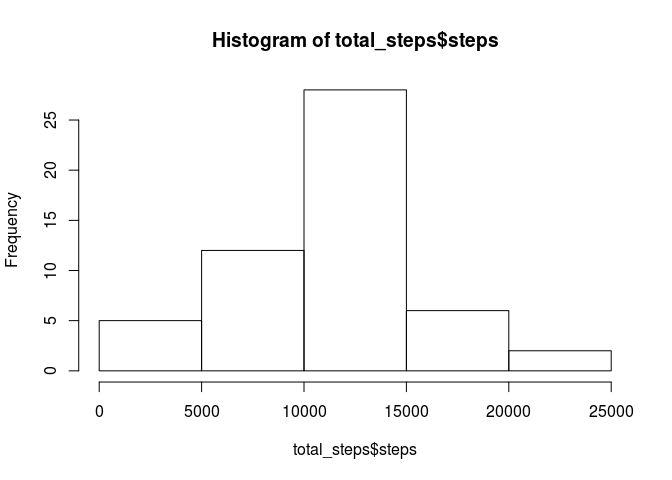
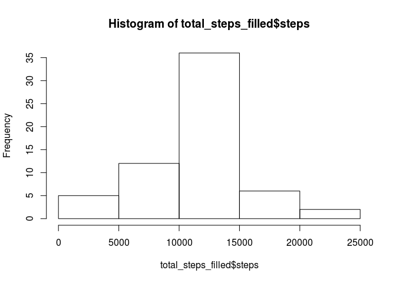
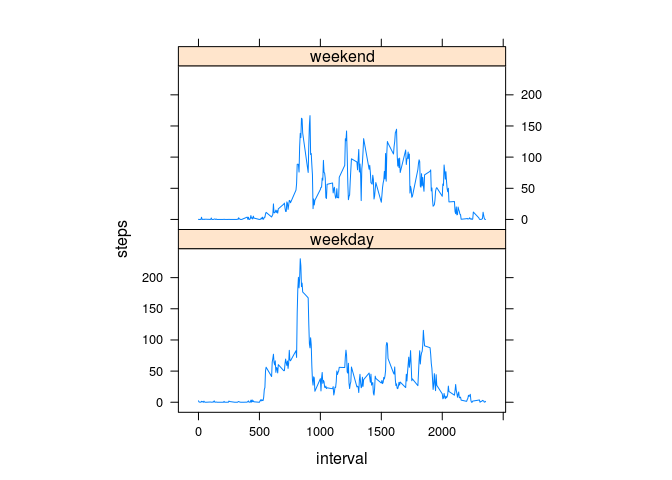

# Reproducible Research: Peer Assessment 1


## Loading and preprocessing the data
Assuming the dataset activity.csv is in the current working directory, we load it.

```r
activity_data <- read.csv("activity.csv")
```
Next, we preprocess the data to get aggregates of the steps based on date.

```r
# Load required library
library(lattice)
total_steps <- aggregate(steps~date, data=activity_data, sum, na.rm=TRUE)
```
## What is mean total number of steps taken per day?
In order to answer this question, we first make a histogram of the total number of steps taken each day.

```r
hist(total_steps$steps)
```

 

Next, we list the mean and median total number of steps taken per day.

```r
mean(total_steps$steps)
```

```
## [1] 10766.19
```

```r
median(total_steps$steps)
```

```
## [1] 10765
```

## What is the average daily activity pattern?

We make a time series plot (i.e. type = "l") of the 5-minute interval (x-axis) and the average number of steps taken, averaged across all days (y-axis). We aggregate the number of steps based on average number of steps across all days over a 5-minute interval.


```r
steps_interval <- aggregate(steps~interval, data=activity_data, mean, na.rm=TRUE)
plot(steps~interval, data=steps_interval, type="l")
```

 

Which 5-minute interval, on average across all the days in the dataset, contains the maximum number of steps?

In order to answer this question, we look at which interval has the maximum number of steps. The following code answers the question.

```r
steps_interval[which.max(steps_interval$steps),]$interval
```

```
## [1] 835
```

## Inputing missing values
Calculate and report the total number of missing values in the dataset (i.e. the total number of rows with NAs)

```r
sum(is.na(activity_data$steps))
```

```
## [1] 2304
```
Total number of rows missing:

```r
sum(is.na(activity_data$steps))
```

```
## [1] 2304
```

Devise a strategy for filling in all of the missing values in the dataset. The strategy does not need to be sophisticated. For example, you could use the mean/median for that day, or the mean for that 5-minute interval, etc.

Here we use a simple strategy of using the mean of the 5-minute interval to fill the missing values. We first create a function to fetch the mean.

```r
interval_missing <- function(interval) {
    steps_interval[steps_interval$interval==interval,]$steps
}
```

Create a new dataset that is equal to the original dataset but with the missing data filled in.


```r
activity_filled <- activity_data
ctr <- 0
for(i in 1:nrow(activity_filled)) {
    if(is.na(activity_filled[i,]$steps)) {
        activity_filled[i,]$steps <- interval_missing(activity_filled[i,]$interval)
        ctr <- ctr + 1
    }
}
```

The number of NAs filled:

```r
ctr
```

```
## [1] 2304
```

Make a histogram of the total number of steps taken each day and Calculate and report the mean and median total number of steps taken per day


```r
total_steps_filled <- aggregate(steps~date, data=activity_filled, sum)
hist(total_steps_filled$steps)
```

 

```r
mean(total_steps_filled$steps)
```

```
## [1] 10766.19
```

```r
median(total_steps_filled$steps)
```

```
## [1] 10766.19
```

Do these values differ from the estimates from the first part of the assignment? What is the impact of imputing missing data on the estimates of the total daily number of steps?

The mean value is the same as the value before imputing missing data because, we use the mean of the 5-minute interval to fill in the NAs. As such there is no change in the mean due to our strategy. 

```r
mean(total_steps$steps) == mean(total_steps_filled$steps)
```

```
## [1] TRUE
```

However, there is a small difference in the median value since the median depends on where exactly these NAs are present.

```r
median(total_steps$steps) == median(total_steps_filled$steps)
```

```
## [1] FALSE
```

## Are there differences in activity patterns between weekdays and weekends?

Create a new factor variable in the dataset with two levels – “weekday” and “weekend” indicating whether a given date is a weekday or weekend day.

```r
tmp <- as.POSIXlt(as.Date(activity_filled$date))
activity_filled$day <- ifelse(tmp$wday%%6==0, "weekend", "weekday")
activity_filled$day <- factor(activity_filled$day, levels=c("weekday", "weekend"))
```

Make a panel plot containing a time series plot (i.e. type = "l") of the 5-minute interval (x-axis) and the average number of steps taken, averaged across all weekday days or weekend days (y-axis).

```r
steps_interval_filled <- aggregate(steps~interval+day, activity_filled, mean)
xyplot(steps~interval|factor(day), data=steps_interval_filled, aspect=1/2, type="l")
```

 
